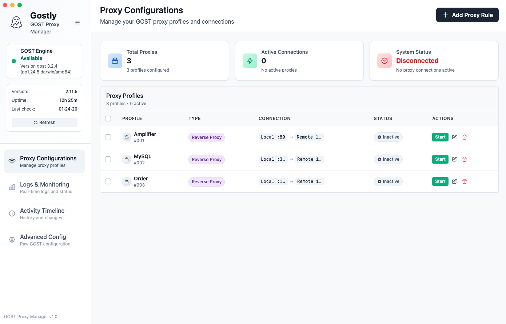
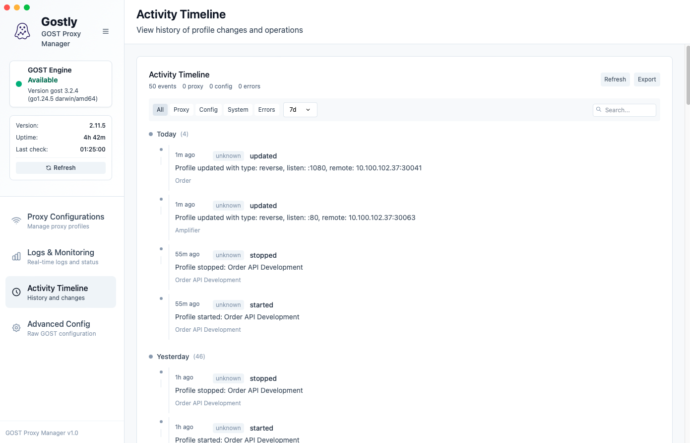
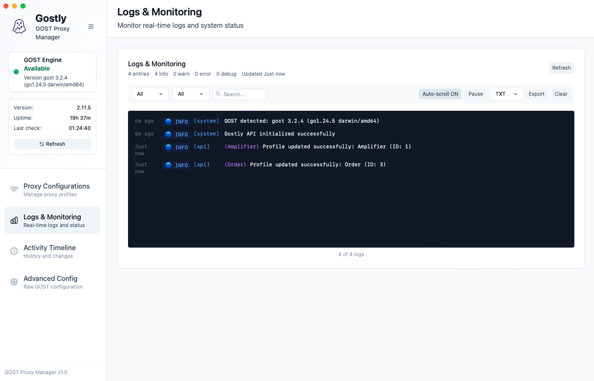
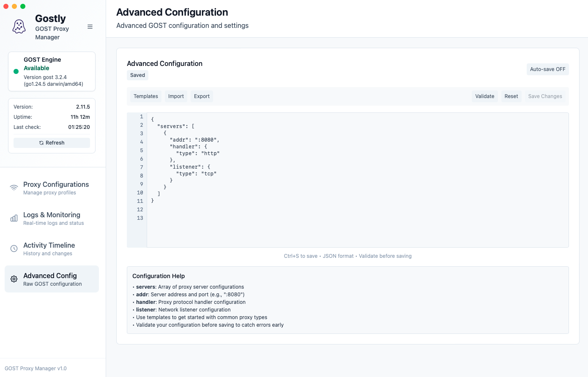

# 🚀 Gostly

> **Modern GOST Proxy Manager** - Elegant desktop application for managing GOST proxy configurations

[](https://golang.org/)
[](https://reactjs.org/)
[](https://wails.io/)
[](LICENSE)
[](https://github.com/imansprn/gostly/actions/workflows/main.yml)
[](https://codecov.io/gh/imansprn/gostly)
[](https://goreportcard.com/report/github.com/imansprn/gostly)

<div align="center">
  
  
  <p><em>Empowering developers to manage proxy infrastructure with elegance and simplicity</em></p>
</div>

---

## ✨ Features

### 🔧 **Core Functionality**
- **Proxy Profile Management** - Create, edit, delete, and manage GOST proxy profiles
- **Multi-Protocol Support** - SOCKS5, HTTP, TCP, UDP, Shadowsocks, VMess, Trojan
- **Real-time Control** - Start/stop proxy services with one click
- **Auto-Installation** - Automatically installs GOST if not present

### 🎨 **User Interface**
- **Modern Dashboard** - Clean, minimalist design with professional aesthetics
- **Responsive Layout** - Collapsible sidebar and adaptive content areas
- **Real-time Monitoring** - Live logs, activity timeline, and status indicators
- **Advanced Configuration** - JSON editor with validation and templates

### 📊 **Monitoring & Analytics**
- **Activity Timeline** - Track all operations with visual timeline
- **Real-time Logs** - Monitor GOST processes with color-coded levels
- **Status Dashboard** - Visual feedback for running/stopped services
- **Configuration Validation** - Built-in JSON validation and error checking

---

## 🖼️ Screenshots

> *Beautiful screenshots showcasing the modern dashboard, proxy management, and monitoring features*

### 📱 **Available Screenshots**

#### 🏠 **Dashboard**
- **Dashboard Overview** - Main application interface *(coming soon)*

#### ⚙️ **Proxy Management**
- **Proxy Management** - Profile creation and editing interface
  

#### 📊 **Monitoring & Logs**
- **Activity Timeline** - Visual operation history with timeline view
  
- **Logs Monitoring** - Real-time process output and monitoring
  

#### 🔧 **Configuration**
- **Advanced Configuration** - JSON editor with validation and templates
  

### 🔗 **Screenshot Documentation**
- 📖 [Detailed Screenshot Guide](docs/screenshots.md)
- 🤝 [Contributing Guide](CONTRIBUTING.md)
- 📝 [Development Setup](#-contributing)

### 📸 **Screenshot Gallery**
<div align="center">
  <p><em>🎉 Screenshots are now available! Click on any image to view in full size.</em></p>
</div>

---

## 🚀 Quick Start

### **Prerequisites**
- **Go 1.23+** - [Download](https://golang.org/dl/)
- **Node.js 18+** - [Download](https://nodejs.org/)
- **Git** - [Download](https://git-scm.com/)
- **GOST 3.0+** - [Download](https://github.com/go-gost/gost/releases) *(Minimum version required)*

### **Installation**

```bash
# Clone the repository
git clone https://github.com/imansprn/gostly.git
cd gostly/gostly

# Install Go dependencies
go mod tidy

# Install frontend dependencies
cd frontend && npm install && cd ..

# Run in development mode
wails dev
```

### **Build for Production**

```bash
# Build for current platform
wails build

# Build for specific platforms
wails build -platform darwin/amd64    # macOS Intel
wails build -platform darwin/arm64    # macOS Apple Silicon
wails build -platform windows/amd64   # Windows
wails build -platform linux/amd64     # Linux
```

### **Creating Releases**

**🚀 Automated Release Process (Release Please):**
1. **Conventional Commits** - Write commits following [Conventional Commits](https://www.conventionalcommits.org/) format:
   ```bash
   feat: add new proxy protocol support
   fix: resolve connection timeout issue
   docs: update installation guide
   ```

2. **Automatic Release Creation**:
   - Release Please automatically detects changes using built-in Go strategy
   - Creates release pull requests with proper versioning
   - Generates changelog from commit messages
   - Creates GitHub releases with all platform artifacts

3. **Manual Release** (if needed):
   - Go to Actions → Release Please → Run workflow
   - Fill in version details and run

**What happens automatically:**
- ✅ Downloads build artifacts from main CI/CD pipeline
- 📦 Creates platform-specific packages (.tar.gz)
- 🚀 Uploads to GitHub Releases
- 🌐 Creates GitHub release with download links
- 📝 Generates changelog from conventional commits
- 🏷️ Tags and versions based on commit types

**Commit Types for Version Bumping:**
- `feat:` - Minor version bump (new features)
- `fix:` - Patch version bump (bug fixes)
- `BREAKING CHANGE:` - Major version bump (breaking changes)

For detailed release instructions, see [CONTRIBUTING.md](CONTRIBUTING.md#-release-process) and [Release Please Guide](docs/RELEASE_PLEASE_GUIDE.md).

---

## 🏗️ Architecture

### **Application Stack**
| Layer | Technology | Purpose |
|-------|------------|---------|
| **Frontend** | React 18 + TypeScript | Modern, responsive UI |
| **Styling** | Tailwind CSS | Utility-first CSS framework |
| **Build Tool** | Vite | Fast development & building |
| **Desktop** | Wails v2 | Native desktop integration |
| **Backend** | Go 1.23 | High-performance proxy management |
| **Database** | SQLite | Lightweight data persistence |
| **Proxy Engine** | GOST | Versatile proxy toolkit |

### **CI/CD Pipeline**
| Workflow | Purpose | Triggers |
|----------|---------|----------|
| **main.yml** | Testing, building, security | Push, PR |
| **release.yml** | Release Please automation | Push to main, manual |
| **dependencies.yml** | Dependency updates | Weekly, manual |

### **Release Management**
- **Release Please** - Automated releases based on conventional commits
- **GitHub Releases** - Artifact distribution and storage
- **Conventional Commits** - Automatic versioning and changelog generation

---

## 📖 Usage Guide

### **Creating Proxy Profiles**

1. **Open Gostly** → Navigate to "Proxy Configurations"
2. **Click "Add Proxy Rule"** → Fill in profile details
3. **Configure settings**:
   - **Name**: Descriptive profile name
   - **Protocol**: Choose GOST protocol type
   - **Listen Address**: Local binding (e.g., `:1080`)
   - **Remote Address**: Target server address
   - **Authentication**: Username/password if required
4. **Save & Start** the profile

### **Managing Services**

- ▶️ **Start Service** - Click the start button
- ⏹️ **Stop Service** - Click the stop button
- ✏️ **Edit Profile** - Modify existing settings
- 🗑️ **Delete Profile** - Remove unused profiles

### **Monitoring & Logs**

- 📊 **Dashboard** - Overview of all profiles and status
- 📝 **Logs & Monitoring** - Real-time GOST process output
- ⏰ **Activity Timeline** - Visual history of operations
- 🔍 **Search & Filter** - Quick profile discovery

---

## 🔧 Configuration

### **Supported GOST Protocols**

| Protocol | Type | Description | Use Case |
|----------|------|-------------|----------|
| `forward` | SOCKS5 | Forward Proxy | Client internet access |
| `reverse` | TCP | Reverse Proxy | Server load balancing |
| `http` | HTTP | HTTP Proxy | Web proxy with auth |
| `tcp` | TCP | TCP Forwarding | Direct port forwarding |
| `udp` | UDP | UDP Forwarding | UDP service proxy |
| `ss` | Shadowsocks | Encrypted Proxy | Secure proxy service |
| `vmess` | VMess | VMess Protocol | Advanced proxy protocol |
| `trojan` | Trojan | Trojan Protocol | Secure proxy tunnel |

### **Environment Variables**

```bash
# GOST binary path (auto-detected)
export GOST_BINARY=/usr/local/bin/gost

# Database location (auto-configured)
export GOSTLY_DB_DIR=~/.config/gostly/

# Log level
export GOSTLY_LOG_LEVEL=info
```

---

## 🧪 Testing & CI/CD

### **Automated Testing**
Our consolidated CI/CD pipeline automatically runs:
- ✅ **Code quality checks** (linting, formatting)
- 🧪 **Go and frontend tests** with coverage reporting
- 🛡️ **Security scanning** (vulnerability checks)
- 🏗️ **Multi-platform builds** (Linux, macOS, Windows)

**Triggers:**
- Every push to `main` and `develop`
- Every pull request
- Manual workflow dispatch

### **Local Testing**

#### **Frontend Tests**
```bash
cd frontend
npm test                    # Run tests
npm run type-check         # TypeScript validation
```

#### **Backend Tests**
```bash
# Run all tests
go test ./...

# Run with coverage
go test -v -race -coverprofile=coverage.out ./...

# View coverage
go tool cover -html=coverage.out
```

#### **Full Build Test**
```bash
# Test complete build process
wails build -debug
```

---

## 📦 Distribution

### **Supported Platforms**

- **macOS** - `.app` bundle, `.dmg` installer
- **Windows** - `.exe` executable, `.msi` installer  
- **Linux** - `.deb`, `.rpm`, `.AppImage`

### **Build Commands**

```bash
# Clean build
wails clean && wails build

# Cross-platform builds
wails build -platform darwin/amd64,linux/amd64,windows/amd64

# Development build
wails build -debug
```

---

## 🤝 Contributing

We welcome contributions! Please see our [Contributing Guide](CONTRIBUTING.md) for details.

### **Development Setup**

```bash
# Fork & clone
git clone https://github.com/YOUR_USERNAME/gostly.git
cd gostly/gostly

# Install dependencies
go mod tidy
cd frontend && npm install && cd ..

# Start development
wails dev
```

### **Code Standards**

- **Go**: Follow `gofmt` and `golint` standards
- **TypeScript**: Use ESLint and Prettier
- **CSS**: Follow Tailwind CSS conventions
- **Commits**: Use [conventional commits](https://conventionalcommits.org/)

---

## 📄 License

This project is licensed under the **MIT License** - see the [LICENSE](LICENSE) file for details.

---

## 🙏 Acknowledgments

- **[GOST Project](https://github.com/ginuerzh/gost)** - Excellent proxy toolkit
- **[Wails Team](https://wails.io/)** - Amazing desktop framework
- **[React Community](https://reactjs.org/)** - Powerful frontend ecosystem
- **[Go Community](https://golang.org/)** - Robust backend language

---

## 📞 Support

### **Getting Help**

- 🐛 **Issues**: [GitHub Issues](https://github.com/imansprn/gostly/issues)
- 💬 **Discussions**: [GitHub Discussions](https://github.com/imansprn/gostly/discussions)
- 📚 **Documentation**: [Wiki](https://github.com/imansprn/gostly/wiki)

### **Community**

- **Discord**: Join our community server
- **Telegram**: Follow updates and announcements
- **Twitter**: Get the latest news

---

<div align="center">
  <p><strong>Made with ❤️ by the Gostly Team</strong></p>
  <p><em>Empowering developers to manage proxy infrastructure with elegance and simplicity</em></p>
</div>
